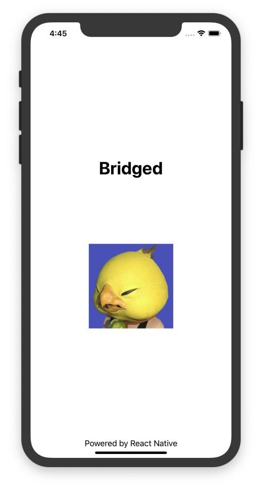

# Bridged - iOS

These instructions are intended to create a new project.

The commands below should be used to initialise a new project similar to this one.

They should **not** be run from this repository.



## Initialise project


### Prerequisites
* Xcode Version 11.3.1 (or later)
* **Tip**: If you have an existing `~/.netrc` file, then ensure the permissions set to `0600`. Otherwise, the CocoaPods installation may fail:
    ```sh
    chmod 600 ~/.netrc`
    ```

---

1. Bootstrap react native:
    ```sh
    npx react-native init [Project Name] --version 0.62.0
    ```
1. Move duplicate Dir components one level up, make sure scripts paths are correct (_optional_)
1. Delete `./android` directory
1. Make sure port `8081` isn't already in use
1. Run instructions for iOS:
    1. Open `./ios/Bridged.xcworkspace` in Xcode or run `xed -b ios`
    2. Hit the Run button

## Xcode
1. Click on the project - very important! 
1. Create a new file: `File > New > File… > Swift File > Next`
1. Name the file `SplashScreenViewController`, click `Create`:
    1. It should prompt: "_Would you like to configure an Objective-C bridging header?_":
        1. Click “_Create bridging header_”
        1. A new `[Project Name]-Bridging-Header.h` file should then also be created
1. Open `ios/AppDelegate.m`, and add `#import <[Project Name]-Swift.h>` this is the converted to Swift to header file
1. Add the following code to the `@implemetation` of `ios/AppDelegate.m`:
    ```objective-c
    {
        // ...
        [self.window makeKeyAndVisible];
  
        SplashScreenViewController *launchController = [[SplashScreenViewController alloc] init];
        
        [launchController view];
        
        launchController.viewController = rootViewController;
        [launchController loadVideo];
        
        return YES;
    }
    ```
    **NB**: This allows us to pass the apps root view to Swift for further styling
1. Update with `SplashScreenViewController` created earlier with the contents of [ios/SplashScreenViewController.swift](./ios/SplashScreenViewController.swift) in this repo
1. Create another Swift file give it a name _(Navigator)_ and update with the contents of [ios/Navigator.swift](./ios/Navigator.swift):
    - This is the code handling the navigation between Swift and React Native
1. In `[Project Name]-Bridging-Header.h` add the modules needed by Swift, in this case: 
    ```objective-c
    #import <React/RCTBridge.h>
    #import <React/RCTEventDispatcher.h>
    #import <React/RCTRootView.h>
    #import <React/RCTBundleURLProvider.h>
    ```
1. Create another Swift file called `Extensions.swift`, this is to add additional methods to existing Swift classed to be reused with the view controller:
    1. Update with the contents of [ios/Extensions.swift](ios/Extensions.swift)
1. Make a copy of the [video](ios/assests/splashscreen.mov) (_or add you own video!_) but ensure the file is named `splashscreen.mov`:
    1. Go to Xcode and click `File > Add files to [Project Name]` and find `splashscreen.mov`
1. Create a new Objective C implementation file: `[Project Name]-swift.m`:
    1. This will emit the methods to React Native
 
## React Native
See [App.js](App.js) for an example.

1. In `./App.js`
    1. Import `NativeModules` from `react-native`
    1. Destructure `{goBack}` from the emitted modules in `Navigator.swift`
    1. Import and add a `Button` and place somewhere on the UI.
        1. Pass the `goBack` function to the `onPress` prop 

## Useful Links
* [Xcode Downloads](https://developer.apple.com/download/all/)
* [CocoaPods](https://guides.cocoapods.org/using/getting-started.html)
