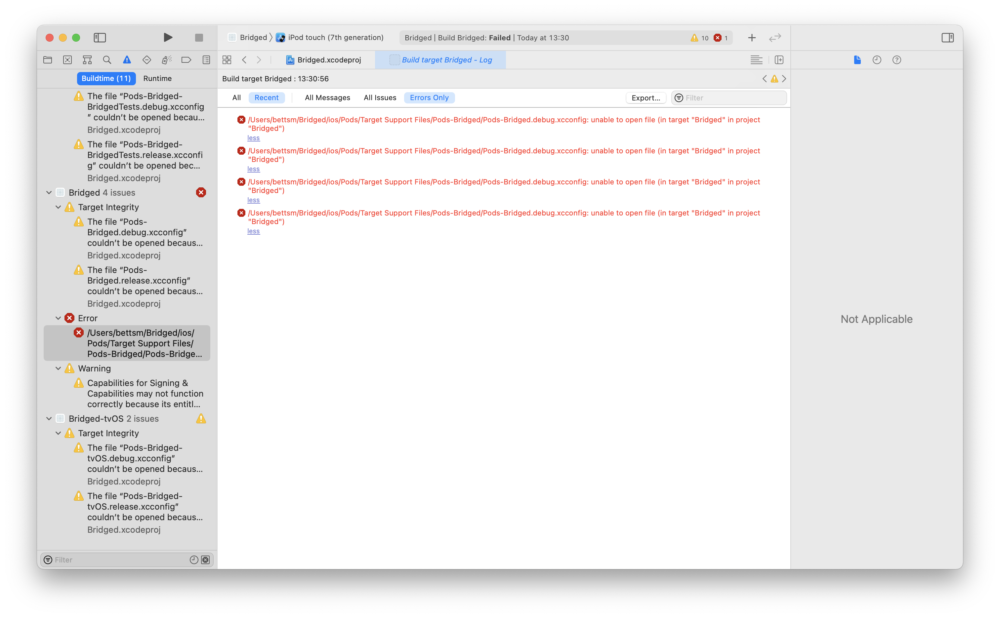
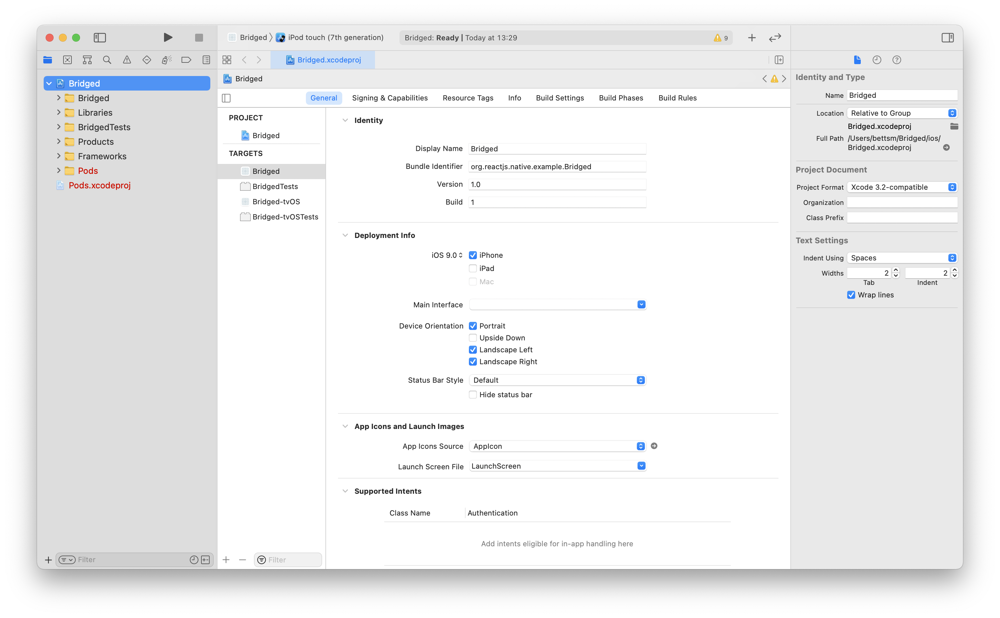

1. Ran: 
`npx react-native init [Project Name] --version 0.62.`

Then got
```
npm ERR! notarget No matching version found for react-native@0.62..
```

2. Ran again:
```
npx react-native init Bridged --version 0.62
```

Then got:
```
error Cannot initialize new project because directory "Bridged" already exists.
```

3. Deleted “Bridged“ directory and ran again:
```
npx react-native init Bridged --version 0.62
```

4. Got prompted to install CocoaPods:

```
? CocoaPods (https://cocoapods.org/) is not installed. CocoaPods is necessary for the iOS project to run correctly. Do you want to install it? › - Use arrow-keys. Return to submit.
❯   Yes, with gem (may require sudo)
    Yes, with Homebrew
```

Picked “Yes, with gem (may require sudo)“

5. This failed:

```
✔ Installing CocoaPods
✖ Installing CocoaPods dependencies (this may take a few minutes)
✖ Installing CocoaPods dependencies (this may take a few minutes)
error Error: Failed to install CocoaPods dependencies for iOS project, which is required by this template.
Please try again manually: "cd ./Bridged/ios && pod install".
CocoaPods documentation: https://cocoapods.org/
```

6. Ran `cd ./Bridged/ios && pod install` (as instructed)

Then got:

```
Analyzing dependencies
Fetching podspec for `DoubleConversion` from `../node_modules/react-native/third-party-podspecs/DoubleConversion.podspec`
Fetching podspec for `Folly` from `../node_modules/react-native/third-party-podspecs/Folly.podspec`
Fetching podspec for `glog` from `../node_modules/react-native/third-party-podspecs/glog.podspec`
[!] Couldn't determine repo type for URL: `https://cdn.cocoapods.org/`: Permission bits for '/Users/bettsm/.netrc' should be 0600, but are 644
```

7. Changed permissions `chmod 600 ~/.netrc` and re-ran `pod install`
   1. `~/.netrc` was setup originally for sdfe-deployment

8. Ran `pod install` again.

This seemed to work:

```
Analyzing dependencies
Fetching podspec for `DoubleConversion` from `../node_modules/react-native/third-party-podspecs/DoubleConversion.podspec`
Fetching podspec for `Folly` from `../node_modules/react-native/third-party-podspecs/Folly.podspec`
Fetching podspec for `glog` from `../node_modules/react-native/third-party-podspecs/glog.podspec`
Adding spec repo `trunk` with CDN `https://cdn.cocoapods.org/`
Downloading dependencies
Installing CocoaAsyncSocket (7.6.5)
Installing DoubleConversion (1.1.6)
Installing FBLazyVector (0.62.3)
Installing FBReactNativeSpec (0.62.3)
Installing Flipper (0.75.1)
Installing Flipper-DoubleConversion (1.1.7)
Installing Flipper-Folly (2.5.3)
Installing Flipper-Glog (0.3.6)
Installing Flipper-PeerTalk (0.0.4)
Installing Flipper-RSocket (1.3.1)
Installing FlipperKit (0.75.1)
Installing Folly (2018.10.22.00)
Installing OpenSSL-Universal (1.1.180)
Installing RCTRequired (0.62.3)
Installing RCTTypeSafety (0.62.3)
Installing React (0.62.3)
Installing React-Core (0.62.3)
Installing React-CoreModules (0.62.3)
Installing React-RCTActionSheet (0.62.3)
Installing React-RCTAnimation (0.62.3)
Installing React-RCTBlob (0.62.3)
Installing React-RCTImage (0.62.3)
Installing React-RCTLinking (0.62.3)
Installing React-RCTNetwork (0.62.3)
Installing React-RCTSettings (0.62.3)
Installing React-RCTText (0.62.3)
Installing React-RCTVibration (0.62.3)
Installing React-cxxreact (0.62.3)
Installing React-jsi (0.62.3)
Installing React-jsiexecutor (0.62.3)
Installing React-jsinspector (0.62.3)
Installing ReactCommon (0.62.3)
Installing Yoga (1.14.0)
Installing YogaKit (1.18.1)
Installing boost-for-react-native (1.63.0)
Installing glog (0.3.5)
Installing libevent (2.1.12)
Generating Pods project
Integrating client project

[!] Please close any current Xcode sessions and use `Bridged.xcworkspace` for this project from now on.
Pod installation complete! There are 47 dependencies from the Podfile and 37 total pods installed.
```

9. I did not understand what this meant, so I skipped this:
> Move duplicate Dir components one level up, make sure scripts paths are correct (optional)

10. I did not have a top-level android directory, so I skipped this:
> Delete /android

Update: I do have a `./Bridged/android`, which I deleted.

11. Ran `npm start`:
```
> react-native start

                                                          
               ######                ######               
             ###     ####        ####     ###             
            ##          ###    ###          ##            
            ##             ####             ##            
            ##             ####             ##            
            ##           ##    ##           ##            
            ##         ###      ###         ##            
             ##  ########################  ##             
          ######    ###            ###    ######          
      ###     ##    ##              ##    ##     ###      
   ###         ## ###      ####      ### ##         ###   
  ##           ####      ########      ####           ##  
 ##             ###     ##########     ###             ## 
  ##           ####      ########      ####           ##  
   ###         ## ###      ####      ### ##         ###   
      ###     ##    ##              ##    ##     ###      
          ######    ###            ###    ######          
             ##  ########################  ##             
            ##         ###      ###         ##            
            ##           ##    ##           ##            
            ##             ####             ##            
            ##             ####             ##            
            ##          ###    ###          ##            
             ###     ####        ####     ###             
               ######                ######               
                                                          
                 Welcome to React Native!
                Learn once, write anywhere


To reload the app press "r"
To open developer menu press "d"
```

12. Opened XCode, opened `~/Bridged/ios/Bridged.xcworkspace`, pressed “Run”

Got the following error:

```
/Users/bettsm/Bridged/ios/Pods/Target Support Files/Pods-Bridged/Pods-Bridged.debug.xcconfig: unable to open file (in target "Bridged" in project "Bridged")
```





14. Opened `~/Bridged/Bridged/ios/Bridged.xcworkspace` and press run

Got the following error:

```
fatal error: module map file '/Users/bettsm/Library/Developer/Xcode/DerivedData/Bridged-hauiyuqkmojewlgrbsntbgqjuzai/Build/Products/Debug-iphonesimulator/YogaKit/YogaKit.modulemap' not found
```


15. Help…!
